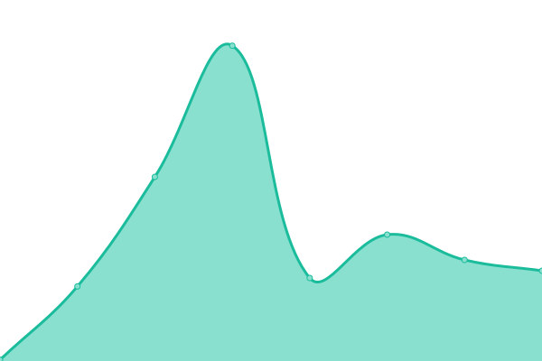

# [📈 Live Status](https://gabstatus.com): <!--live status--> **🟧 Partial outage**

This repository contains the open-source uptime monitor and status page for [gadmln](https://gabstatus.com), powered by [Upptime](https://github.com/upptime/upptime).

With [Upptime](https://upptime.js.org), you can get your own unlimited and free uptime monitor and status page, powered entirely by a GitHub repository. We use [Issues](https://github.com/gadmln/gabstatus/issues) as incident reports, [Actions](https://github.com/gadmln/gabstatus/actions) as uptime monitors, and [Pages](https://gabstatus.com) for the status page.

<!--start: status pages-->
<!-- This summary is generated by Upptime (https://github.com/upptime/upptime) -->
<!-- Do not edit this manually, your changes will be overwritten -->
<!-- prettier-ignore -->
| URL | Status | History | Response Time | Uptime |
| --- | ------ | ------- | ------------- | ------ |
|  [Social](https://gab.com) | 🟩 Up | [social.yml](https://github.com/gadmln/gabstatus/commits/HEAD/history/social.yml) | 

 154ms
     
 | 

<a href="https://gabstatus.com/history/social">100.00%</a>
    

|  [TV](https://tv.gab.com) | 🟩 Up | [tv.yml](https://github.com/gadmln/gabstatus/commits/HEAD/history/tv.yml) | 

 754ms
     
 | 

<a href="https://gabstatus.com/history/tv">100.00%</a>
    

|  [Trends](https://trends.gab.com) | 🟩 Up | [trends.yml](https://github.com/gadmln/gabstatus/commits/HEAD/history/trends.yml) | 

 351ms
     
 | 

<a href="https://gabstatus.com/history/trends">100.00%</a>
    

|  [Dissenter](https://dissenter.com) | 🟥 Down | [dissenter.yml](https://github.com/gadmln/gabstatus/commits/HEAD/history/dissenter.yml) | 

 295ms
     
 | 

<a href="https://gabstatus.com/history/dissenter">100.00%</a>
    

|  [Gab Shop](https://shop.dissenter.com) | 🟩 Up | [gab-shop.yml](https://github.com/gadmln/gabstatus/commits/HEAD/history/gab-shop.yml) | 

 344ms
     
 | 

<a href="https://gabstatus.com/history/gab-shop">100.00%</a>
    

|  [Gab PRO](https://pro.gab.com) | 🟩 Up | [gab-pro.yml](https://github.com/gadmln/gabstatus/commits/HEAD/history/gab-pro.yml) | 

 225ms
     
 | 

<a href="https://gabstatus.com/history/gab-pro">100.00%</a>
    

|  [Gab News](https://news.gab.com) | 🟩 Up | [gab-news.yml](https://github.com/gadmln/gabstatus/commits/HEAD/history/gab-news.yml) | 

 390ms
     
 | 

<a href="https://gabstatus.com/history/gab-news">100.00%</a>
    

|  [E2EE Chat (chat.gab.com)](https://chat.gab.com) | 🟩 Up | [e2-ee-chat-chat-gab-com.yml](https://github.com/gadmln/gabstatus/commits/HEAD/history/e2-ee-chat-chat-gab-com.yml) | 

 264ms
     
 | 

<a href="https://gabstatus.com/history/e2-ee-chat-chat-gab-com">100.00%</a>
    

<!--end: status pages-->

[**Visit our status website →**](https://gabstatus.com)

## 📄 License

- Powered by: [Upptime](https://github.com/upptime/upptime)
- Code: [MIT](./LICENSE) © [gadmln](https://gabstatus.com)
- Data in the `./history` directory: [Open Database License](https://opendatacommons.org/licenses/odbl/1-0/)
